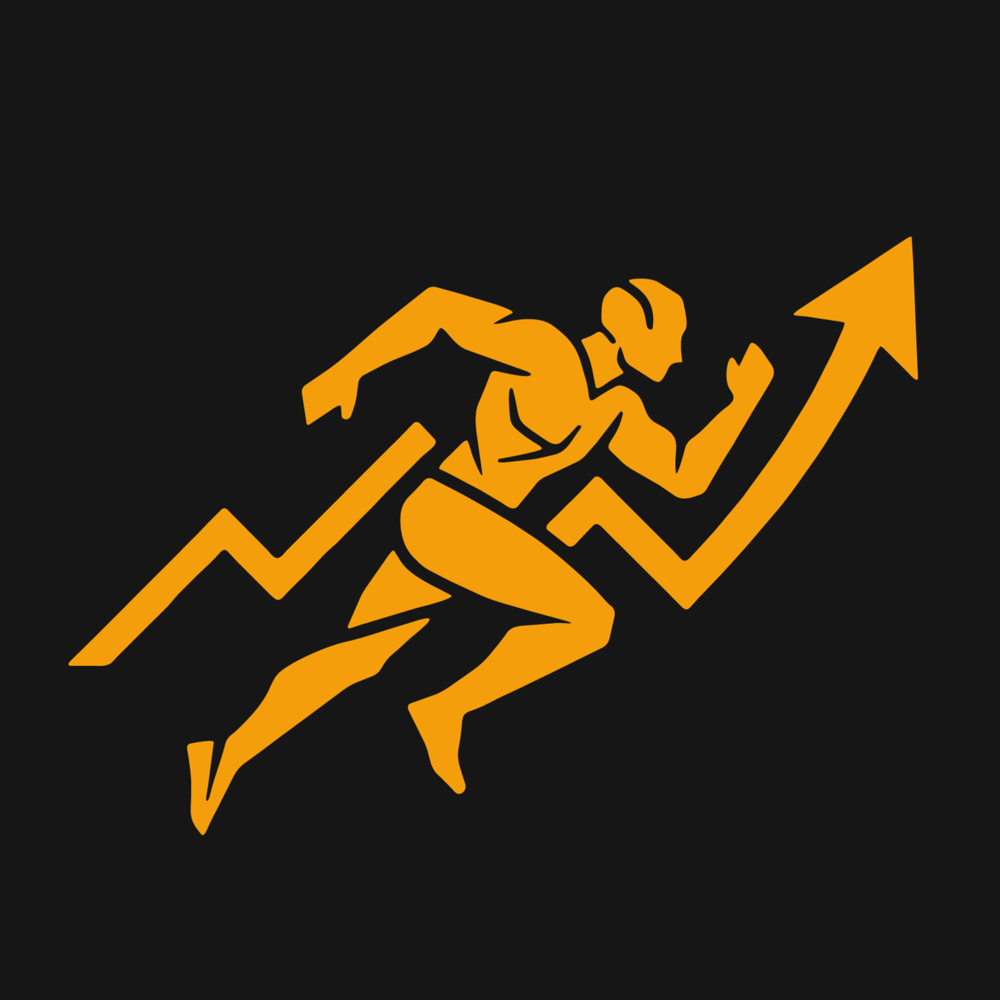

<div align="center">
  

  # TCX Tracker

  **Importa tus entrenamientos, mide tu progreso, visualiza todo desde el navegador.**

  
  
  
  
  

</div>

---

TCX Tracker es una aplicación local para runners que quieren controlar su progreso sin depender de Garmin Connect, Strava ni ningún servicio externo. Lee archivos `.tcx` exportados desde cualquier dispositivo (Garmin, Zepp/Amazfit, Polar…), guarda los datos en una base de datos SQLite y los muestra en un dashboard web con gráficas interactivas.

---

## Características

### Dashboard principal

- **Watcher automático** — vigila una carpeta y detecta nuevos `.tcx` al instante, sin intervención manual
- **Resumen global** — total de km, horas, calorías, km del mes actual y racha de semanas activas
- **Eficiencia aeróbica** — metros recorridos por latido a lo largo del tiempo; la métrica más importante para seguir la evolución del fitness
- **Carga semanal** — kilómetros y tiempo por semana para controlar el volumen
- **Zonas de FC** — calculadas segundo a segundo desde los trackpoints, no estimadas
- **Récords personales** — calculados mediante ventana deslizante GPS (Haversine) sobre todos los trackpoints para 1 km, 3 km, 5 km, 10 km, media maratón y maratón. Muestra el tiempo real, la fecha y el segmento exacto (ej. *km 2.1 – 3.1*)
- **Heatmap de consistencia** — visualización de los últimos 365 días al estilo GitHub
- **Historial completo** — tabla con todos los entrenamientos ordenada por fecha

### Filtrado por fechas

- Atajos rápidos: 30 días, 3 meses, 6 meses, 1 año
- Selector libre de fechas de inicio y fin
- Todas las gráficas y tarjetas del dashboard se actualizan simultáneamente
- Badge naranja que indica el rango activo

### Comparativa entre períodos

- Compara dos bloques de fechas a elección (pre-rellena mes anterior vs mes actual)
- Métricas comparadas: salidas, km totales, km por salida, ritmo medio, FC media, tiempo total y kcal por salida
- Deltas porcentuales con colores: verde = mejora, rojo = empeora
- Gráfica de km semanales superpuestos de ambos períodos

### Vista de detalle por entrenamiento

Al clicar cualquier fila de la tabla se abre una vista completa con:

- Métricas de cabecera: distancia, tiempo, ritmo, FC media, FC máxima, cadencia y calorías
- **Gráfica de ritmo** — calculada en bloques de 30 s para eliminar ruido GPS, en min/km con eje Y invertido
- **Gráfica de FC** — segundo a segundo
- **Gráfica de cadencia** — pasos por minuto
- **Gráfica de longitud de zancada** — metros calculados como `velocidad / (cadencia / 60)`
- **Zonas FC de la sesión** — distribución Z1–Z5 calculada solo con los trackpoints del entrenamiento
- **Splits por kilómetro** — ritmo, FC media, cadencia y velocidad (km/h) de cada km; el más rápido en verde, el más lento en rojo

### Análisis de intervalos

Cuando se detecta un entrenamiento con fases de carrera y recuperación, aparece automáticamente un panel adicional con:

- **Detección por cadencia** — usa la cadencia como señal principal (mucho más estable que el GPS). Umbral calculado automáticamente encontrando el valle en la distribución bimodal. Fallback a velocidad si no hay cadencia disponible
- **Corrección half-step** — detecta si el reloj reporta pasos por pierna y aplica ×2 automáticamente
- **Por intervalo** — duración, ritmo, FC media, cadencia y velocidad de cada esfuerzo
- **Por recuperación** — duración, ritmo y FC. Los tramos de calentamiento y enfriamiento se excluyen automáticamente
- **Progresión** — etiqueta automática: ↗ acelerando, ↘ desacelerando, → estable
- **Gráfica de progresión** — barras por intervalo (verde = más rápido que la media, ámbar = más lento) con línea de media
- **Estadísticas globales** — ritmo, FC, cadencia y velocidad medias separadas para los tramos corriendo vs andando

### Gestión

- **Eliminar entrenamientos** — botón en la tabla (con confirmación) y también vía CLI
- **Exportar a CSV** — descarga el historial completo en un CSV con BOM (compatible con Excel directamente)

---

## Requisitos

- Python 3.10+
- `pip install flask`
- O simplemente Docker

---

## Instalación local

```bash
git clone https://github.com/tuusuario/tcx-tracker.git
cd tcx-tracker
pip install flask
```

Pon tus archivos `.tcx` en la carpeta `Archivos/` y arranca el watcher:

```bash
python tcx_tracker.py watch
```

En otra terminal, lanza el dashboard:

```bash
python dashboard_server.py
# → http://localhost:5000
```

---

## Instalación con Docker (NAS)

La opción recomendada para tener el tracker corriendo permanentemente en un NAS o servidor doméstico.

```bash
git clone https://github.com/tuusuario/tcx-tracker.git
cd tcx-tracker
docker compose up -d --build
# → http://IP-DEL-NAS:5000
```

El contenedor arranca solo con el sistema y vigila `data/Archivos/`. Los datos persisten en `data/` aunque el contenedor se reconstruya.

### Estructura de carpetas

```
tcx-tracker/
├── Dockerfile
├── docker-compose.yml
├── start.sh
├── tcx_tracker.py
├── dashboard_server.py
├── dashboard.html
└── data/                  ← generada automáticamente
    ├── Archivos/          ← aquí van los .tcx
    ├── workouts.db        ← base de datos SQLite
    └── tcx_tracker.log    ← log de importaciones
```

---

## Uso del CLI

```bash
# Vigilar carpeta automáticamente (modo principal)
python tcx_tracker.py watch
python tcx_tracker.py watch /ruta/personalizada

# Importar manualmente
python tcx_tracker.py import archivo.tcx
python tcx_tracker.py import carpeta/

# Consultas
python tcx_tracker.py list                    # listar todos los entrenamientos
python tcx_tracker.py stats                   # estadísticas globales
python tcx_tracker.py show 5                  # detalle de un entrenamiento por ID
python tcx_tracker.py export 5                # exportar trackpoints a CSV

# Gestión
python tcx_tracker.py delete 5                # eliminar (pide confirmación)
python tcx_tracker.py delete 5 --confirm      # eliminar sin confirmar
```

---

## Métricas registradas

| Métrica | Descripción |
|---|---|
| Distancia | Kilómetros totales por sesión |
| Tiempo | Duración real de la sesión |
| Ritmo medio | min/km calculado como tiempo / distancia |
| FC media / máxima | Pulsaciones por minuto |
| Cadencia media | Pasos por minuto (con corrección half-step automática) |
| Calorías | Kcal de la sesión |
| Eficiencia aeróbica | m/latido = velocidad_ms / (FC / 60) |
| Zonas FC | Distribución Z1–Z5 segundo a segundo desde trackpoints |
| Récords | Ventana deslizante GPS con Haversine: 1k, 3k, 5k, 10k, 21k, 42k |
| Splits | Ritmo, FC, cadencia y velocidad por kilómetro |
| Intervalos | Fases run/walk detectadas por cadencia con estadísticas separadas |
| Trackpoints | GPS + FC + velocidad + cadencia por segundo |

---

## Compatibilidad

Probado con archivos `.tcx` exportados desde:
- **Zepp / Amazfit** (Zepp App)
- **Garmin Connect**

Debería funcionar con cualquier dispositivo que exporte `.tcx` estándar (Polar, Suunto, Wahoo…).

> **Nota sobre cadencia Zepp:** algunos relojes reportan pasos por pierna en lugar de totales. TCX Tracker lo detecta automáticamente y aplica ×2 cuando es necesario.

---

## Actualizar

```bash
git pull
docker compose up -d --build   # si usas Docker
```

Si solo cambias `.py` o `.html` sin tocar el `Dockerfile`:

```bash
docker compose restart tcx-tracker
```

---

## Roadmap

- [ ] Soporte para archivos `.fit` (Garmin nativo)
- [ ] Predictor de tiempos por distancia (fórmula de Riegel)
- [ ] Alertas de sobreentrenamiento (ratio carga aguda/crónica)
- [ ] Exportar rutas a GPX para visualizar en mapas
- [ ] Notas editables por entrenamiento desde el dashboard

---

## Licencia

MIT