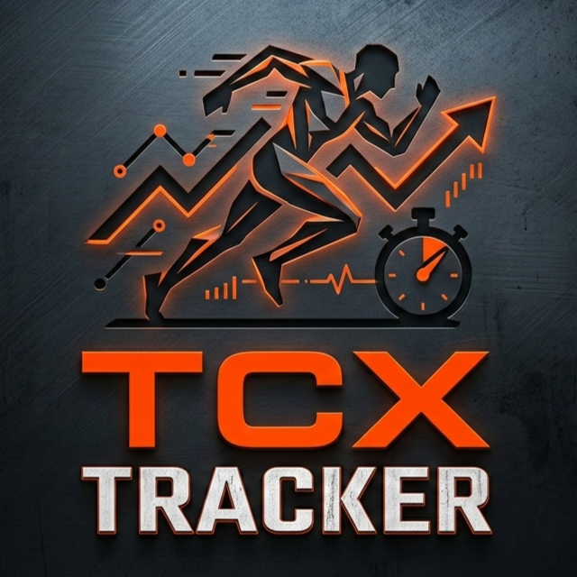

<div align="center">
  

  # TCX Tracker

  **Importa tus entrenamientos, mide tu progreso, visualiza todo desde el navegador.**

  
  
  
  
  

</div>

---

TCX Tracker es una aplicación local para runners que quieren controlar su progreso sin depender de Garmin Connect, Strava ni ningún servicio externo. Lee archivos `.tcx` exportados desde cualquier dispositivo (Garmin, Zepp/Amazfit, Polar…), guarda los datos en una base de datos SQLite y los muestra en un dashboard web con gráficas interactivas.

## Capturas

> Dashboard oscuro con gráficas de eficiencia aeróbica, carga semanal, zonas de FC, récords personales y heatmap de consistencia.

## Características

- **Watcher automático** — vigila una carpeta y detecta nuevos archivos `.tcx` al instante, sin intervención manual
- **Dashboard web** — gráficas interactivas servidas en el navegador, accesibles desde cualquier dispositivo de la red local
- **Eficiencia aeróbica** — la métrica más importante: metros recorridos por latido a lo largo del tiempo
- **Carga semanal** — kilómetros y tiempo por semana para controlar el volumen de entrenamiento
- **Zonas de FC** — calculadas segundo a segundo desde los trackpoints, no estimadas
- **Récords personales** — actualizados automáticamente en 1 km, 3 km, 5 km y 10 km
- **Heatmap de consistencia** — visualización de los últimos 365 días al estilo GitHub
- **Export a CSV** — trackpoints completos (GPS, FC, velocidad, cadencia) exportables por entrenamiento
- **Docker ready** — pensado para correr en un NAS como servicio permanente

## Requisitos

- Python 3.10+
- `pip install flask`
- O simplemente Docker

## Instalación local

```bash
git clone https://github.com/tuusuario/tcx-tracker.git
cd tcx-tracker
pip install flask
```

Pon tus archivos `.tcx` en la carpeta `Archivos/` y arranca el watcher:

```bash
python tcx_tracker.py watch
```

En otra terminal, lanza el dashboard:

```bash
python dashboard_server.py
# → http://localhost:5000
```

## Instalación con Docker (NAS)

La opción recomendada para tener el tracker corriendo permanentemente en un NAS o servidor doméstico.

```bash
git clone https://github.com/tuusuario/tcx-tracker.git
cd tcx-tracker
docker compose up -d --build
# → http://IP-DEL-NAS:5000
```

El contenedor arranca solo con el sistema y vigila la carpeta `data/Archivos/` en busca de nuevos archivos.

### Estructura de carpetas

```
tcx-tracker/
├── Dockerfile
├── docker-compose.yml
├── start.sh
├── tcx_tracker.py
├── dashboard_server.py
├── dashboard.html
└── data/                  ← generada automáticamente
    ├── Archivos/          ← aquí van los .tcx
    ├── workouts.db        ← base de datos
    └── tcx_tracker.log    ← log de importaciones
```

Tanto la base de datos como los archivos `.tcx` persisten en `data/` aunque el contenedor se reconstruya.

## Uso del CLI

```bash
# Vigilar carpeta automáticamente (modo principal)
python tcx_tracker.py watch
python tcx_tracker.py watch /ruta/personalizada

# Importar manualmente
python tcx_tracker.py import archivo.tcx
python tcx_tracker.py import carpeta/

# Consultas
python tcx_tracker.py list           # listar todos los entrenamientos
python tcx_tracker.py stats          # estadísticas globales + resumen mensual
python tcx_tracker.py show 5         # detalle de un entrenamiento por ID
python tcx_tracker.py export 5       # exportar trackpoints a CSV
```

## Métricas registradas

| Métrica | Descripción |
|---|---|
| Distancia | Kilómetros totales |
| Tiempo | Duración de la sesión |
| Ritmo medio | min/km calculado desde trackpoints |
| FC media / máxima | Pulsaciones por minuto |
| Cadencia media | Pasos por minuto |
| Calorías | Kcal de la sesión |
| Eficiencia aeróbica | m/latido (velocidad ÷ FC) |
| Zonas de FC | Distribución Z1–Z5 segundo a segundo |
| Trackpoints | GPS + HR + velocidad + cadencia por segundo |

## Compatibilidad

Probado con archivos `.tcx` exportados desde:
- **Zepp / Amazfit** (Zepp App)
- **Garmin Connect**

Debería funcionar con cualquier dispositivo que exporte `.tcx` estándar (Polar, Suunto, Wahoo…).

## Actualizar

```bash
git pull
docker compose up -d --build   # si usas Docker
```

Si solo cambias `.py` o `.html` sin tocar el `Dockerfile`:

```bash
docker compose restart tcx-tracker
```

## Roadmap

- [ ] Filtrado por rango de fechas en el dashboard
- [ ] Comparativa entre períodos (mes a mes, bloque a bloque)
- [ ] Détection automática de récords al importar
- [ ] Soporte para archivos `.fit` (Garmin nativo)
- [ ] Alertas de sobrecarga (regla del 10%)

## Licencia

MIT